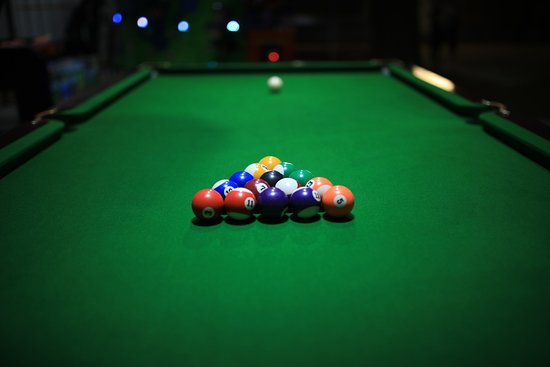

# 8 Ball Pool Game

A fully-featured billiards game built with Python, featuring single-player AI, multiplayer, and skill challenge modes with realistic physics simulation.



## 🎱 Features

### Game Modes
- **Single-Player Mode**: Challenge an AI opponent with three difficulty levels (Easy, Medium, Hard)
- **Multi-Player Mode**: Play locally with a friend, taking turns on the same computer
- **Skill Challenge**: Race against the clock to pocket all red balls with minimal penalties

### Physics & Mechanics
- Realistic ball collision physics using vector mathematics
- Friction and momentum simulation
- Ray-casting aim prediction system
- Shot power control based on drag distance
- Visual trajectory prediction for shot planning

### AI Opponent
The AI uses recursive pathfinding to:
- Analyze all possible shot angles
- Calculate optimal ball-to-pocket trajectories
- Adjust difficulty by changing angle precision
- Make strategic decisions based on game state

## 🚀 Getting Started

### Prerequisites
- Python 3.x
- PIL/Pillow library (for image handling)

### Installation

1. Clone this repository:
```bash
git clone https://github.com/yourusername/8ball-pool.git
cd 8ball-pool
```

2. Install required dependencies:
```bash
pip install pillow
```

### Required Files
Ensure these files are in the same directory:
- `tp_8ball_sandreu.py` (main game file)
- `cmu_112_graphics.py` (graphics framework)
- `tp-start-screen.png` (start screen background)
- `difficulty-screen.png` (difficulty selection screen)
- `leaderboard-screen.png` (leaderboard background)
- `skillChallenge-leaderboard.txt` (stores high scores)

### Running the Game
```bash
python tp_8ball_sandreu.py
```

## 🎮 How to Play

### Basic Controls
1. **Aim**: Click and hold on the cue ball
2. **Set Power**: Drag mouse away from the cue ball (further = more power)
3. **Shoot**: Release mouse button

### Keyboard Shortcuts
- `R` - Restart game
- `I` - Toggle instructions
- `L` - View leaderboard (Skill Challenge mode only)
- Arrow Keys - Manual ball control (for testing):
  - `Up/Down` - Adjust angle
  - `Left/Right` - Adjust speed

### Game Rules

#### Standard 8-Ball Rules
- **Player 1** (Red): Pocket all red balls, then the 8-ball
- **Player 2** (Blue): Pocket all blue balls, then the 8-ball
- Players alternate turns unless they pocket their own ball
- First player to legally pocket the 8-ball after clearing their balls wins
- Pocketing the cue ball returns it to the starting position

#### Skill Challenge Scoring
- **Objective**: Pocket all 5 red balls as quickly as possible
- Base score increases by 100 points every 3 seconds
- **Penalty**: +500 points for each non-red ball pocketed
- Lower score is better
- Top 5 scores saved to leaderboard

## 🧠 Technical Highlights

### Physics Implementation
- **Collision Detection**: Distance-based detection between all ball pairs
- **Elastic Collisions**: Uses unit normal/tangent vector decomposition
- **Wall Bouncing**: Angle reflection at boundaries
- **Friction Model**: Exponential decay (0.985x per frame) for realistic deceleration

### AI Algorithm
```
computerTurn():
  For each angle (step size based on difficulty):
    - Ray-cast to find target ball
    - Verify it's the correct color
    - Predict trajectory after collision
    - Check if prediction hits pocket
    - Track best shot (smallest angle deviation)
  Execute optimal shot
```

### Ray-Casting System
- Shoots multiple rays in cone pattern for accuracy
- Traces path until hitting ball or boundary
- Calculates collision points and resulting trajectories
- Powers both player aim assist and AI decision-making

## 📊 Project Structure

```
tp_8ball_sandreu.py
├── Ball class         - Ball physics and movement
├── Pocket class       - Pocket positions and detection
├── Game Logic         - Collision, scoring, turn management
├── AI Functions       - Computer opponent strategy
├── Drawing Functions  - Canvas rendering
└── File I/O           - Leaderboard persistence
```

## 🎯 Future Improvements

Potential enhancements:
- Online multiplayer support
- Custom ball/table skins
- Advanced shot techniques (spin, bank shots)
- Tournament mode
- Replay system
- Sound effects and music
- Mobile touch controls

## 📝 Credits

**Author**: Sebastian Andreu (sandreu)  
**Course**: CMU 15-112 Term Project  
**Framework**: CMU 112 Graphics Library

### References
- [2D Collision Physics](https://imada.sdu.dk/~rolf/Edu/DM815/E10/2dcollisions.pdf)
- [Official 8-Ball Rules (BCA)](https://www.colorado.edu/umc/sites/default/files/attached-files/8-ball_rules_bca.pdf)

## 📄 License

This project was created for educational purposes as part of CMU's 15-112 course.

---

*Enjoy the game! Feel free to fork, modify, and improve upon this project.*